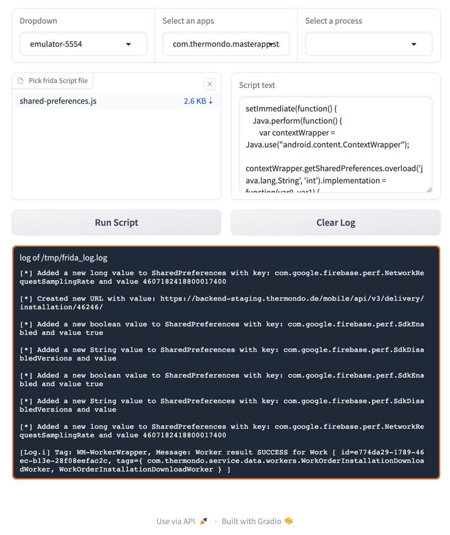

# frida-debugger-gradio

### requirements

- Poetry (https://python-poetry.org/)
- Python 3.8 or higher

### install

- create an environment
- install dependencies in `requirements.txt` with poetry

- run the script

```bash
poetry run python main.py
```

``` bash
❯ poetry run python main.py
Running on local URL:  http://127.0.0.1:7862
To create a public link, set `share=True` in `launch()`.
```

